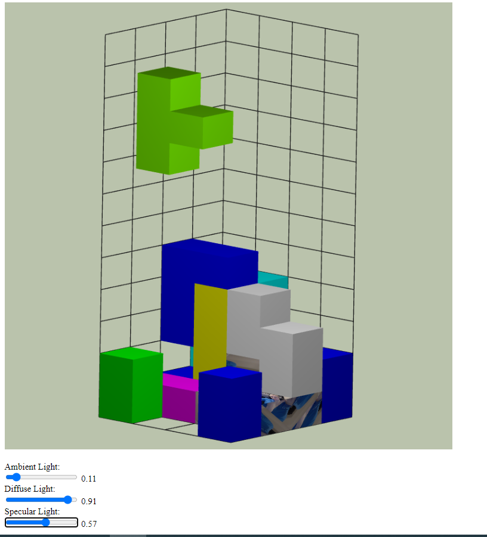
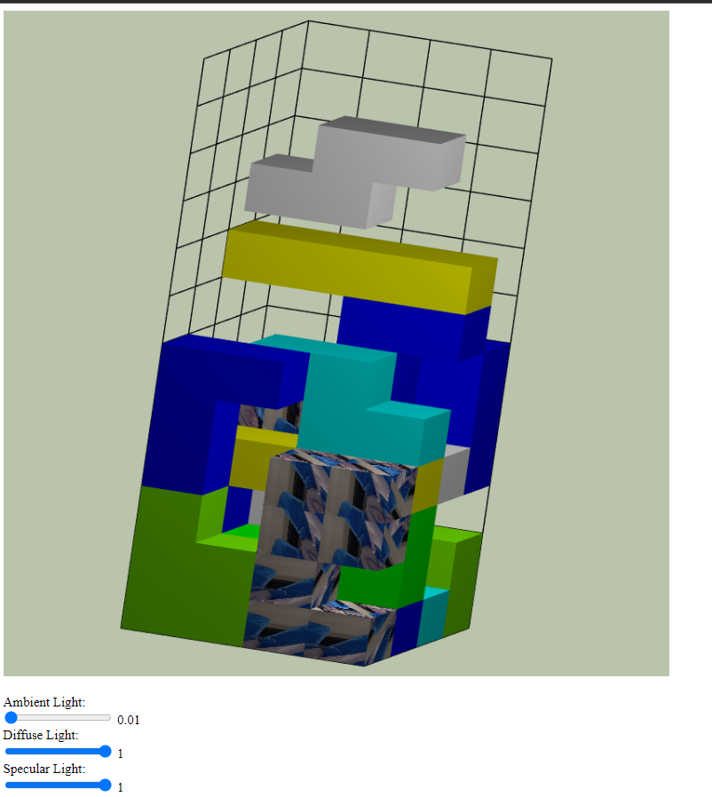

# This is a 3d tetris game implemented in WebGL and javascript.
## Screenshots:

## Movement and rotations were implemented so game should be normally playable.

# How to run
## To run the program use command : python -m  http.server {port}
 

<kbd>-></kbd> or <kbd>d</kbd>: move the object drawn one unit in the positive x direction

<kbd><-</kbd> or <kbd>a</kbd>: move the object drawn one unit in the negative x direction
<kbd>/\</kbd> or <kbd>w</kbd>: move the object drawn one unit in the negative z direction
<kbd>\/</kbd> or <kbd>s</kbd>: move the object drawn one unit in the positive z direction
<kbd>x</kbd>: rotate the object drawn 90 degrees counterclockwise around the x axis
<kbd>X</kbd>: rotate the object drawn 90 degrees clockwise around the x axis
<kbd>y</kbd>: rotate the object drawn 90 degrees counterclockwise around the y axis
<kbd>Y</kbd>: rotate the object drawn 90 degrees clockwise around the y axis
<kbd>z</kbd>: rotate the object drawn 90 degrees counterclockwise around the z axis
<kbd>Z</kbd>: rotate the object drawn 90 degrees clockwise around the z axis
<kbd>p</kbd>: (un)pause the game (i.e. stop/restart gravity) It pauses only gravity and mouse camera movement.
<kbd>g</kbd>: enable/ disable grid

<kbd>j</kbd>: the viewpoint should rotate counterclockwise about the Y-axis around the center of the grid.
<kbd>l</kbd>: the viewpoint should rotate clockwise about the Y-axis around the center of the grid.
<kbd>i</kbd>: the viewpoint should rotate counterclockwise about the X-axis around the center of the grid.
<kbd>k</kbd>: the viewpoint should rotate clockwise about the X-axis around the center of the grid.
<kbd>u</kbd>: the viewpoint should rotate counterclockwise about the Z-axis around the center of the grid.
<kbd>o</kbd>: the viewpoint should rotate clockwise about the Z-axis around the center of the grid.
<kbd>+</kbd>: zoom in
<kbd>-</kbd>: zoom out.
<kbd>v</kbd>: toggle between orthographic and perspective viewing.
<kbd>f</kbd>: change between phong and goraud shading
<kbd>b</kbd>: change between smaller and bigger cubes (change of vertices)

Runs on 
google chrome
version 113.0.5672.127 (Oficjalna wersja) (64-bitowa)
OS
Windows 10 Education N version 22H2
